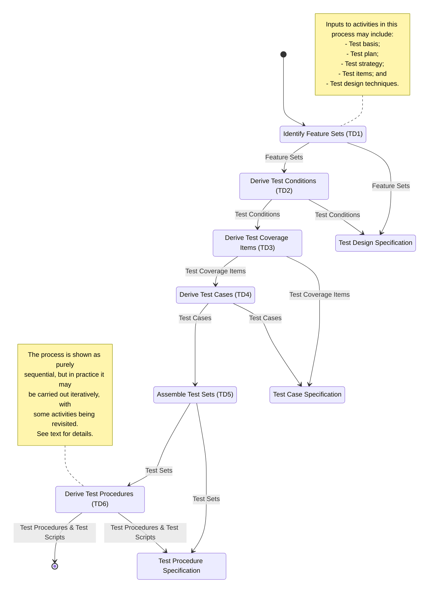

# Test Design & Implementation Process

```mermaid
stateDiagram-v2
    TD1: Identify Feature Sets (TD1)
    TD2: Derive Test Conditions (TD2)
    TD3: Derive Test Coverage Items (TD3)
    TD4: Derive Test Cases (TD4)
    TD5: Assemble Test Sets (TD5)
    TD6: Derive Test Procedures (TD6)
    Out1: Test Design Specification
    Out2: Test Case Specification
    Out3: Test Procedure Specification
    [*] --> TD1
    TD1 --> TD2: Feature Sets
    TD1 --> Out1: Feature Sets
    TD2 --> TD3: Test Conditions
    TD2 --> Out1: Test Conditions
    TD3 --> TD4: Test Coverage Items
    TD3 --> Out2: Test Coverage Items
    TD4 --> TD5: Test Cases
    TD4 --> Out2: Test Cases
    TD5 --> TD6: Test Sets
    TD5 --> Out3: Test Sets
    TD6 --> [*]: Test Procedures & Test Scripts
    TD6 --> Out3: Test Procedures & Test Scripts
    note left of TD1
      Inputs to activities in this process may include:
        - Test basis;
        - Test plan;
        - Test strategy;
        - Test items; and
        - Test design techniques.
    end note
    note left of TD6
      The process is shown as purely
      sequential, but in practice it may
      be carried out iteratively, with
      some activities being revisited.
      See text for details.
    end note
```
