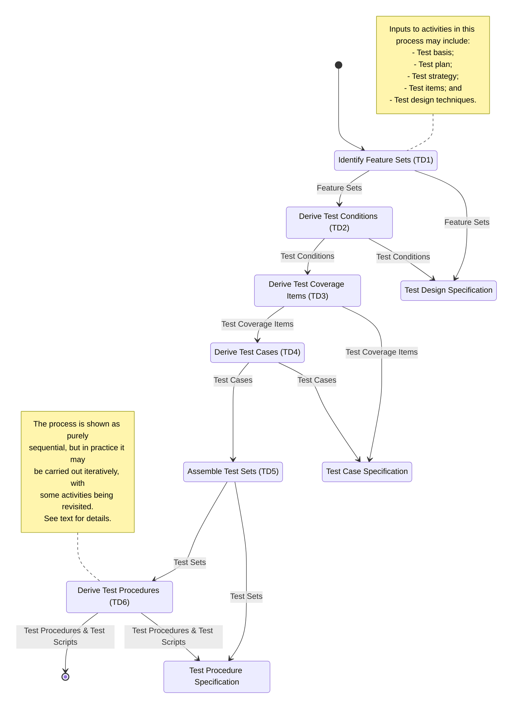

# Test Design & Implementation Process

This material is from ISO 29119-2 clause 8.2 found on pages 29-33

## Identify Feature Sets

The detailed description of the "Identify Feature Sets (TD1)" activity provides a structured approach to understanding and organizing the features to be tested. Let's break down each task within this activity:

1. **Analyze the Test Basis**:
   - Task: The test basis, which includes requirements, specifications, and other relevant documentation, is analyzed to understand the requirements for the test item.
   - Note 1: Any defects or inconsistencies uncovered during this analysis are reported using an appropriate incident management system.

2. **Combine Features into Feature Sets**:
   - Task: The features to be tested are combined into logical groups known as feature sets.
   - Note 2: Feature sets can be tested independently of each other, simplifying testing efforts and allowing for modular testing.
   - Note 3: Depending on the level of testing (e.g., component testing, system testing), there may be multiple feature sets mirroring the architecture of the test item. However, for lower levels of testing, such as unit testing, there might be only a single feature set.
   - Note 4: If multiple feature sets are not identified, the set of features will be treated as a single feature set.

3. **Prioritize Feature Sets**:
   - Task: The testing of feature sets is prioritized using risk exposure levels documented in the Identify and Analyze Risks activity (TP3).
   - Note 5: This task may require revisiting tasks a), b), and c) if necessary adjustments or additional analysis are needed.

4. **Agree on Composition and Prioritization with Stakeholders**:
   - Task: The composition and prioritization of feature sets are agreed upon with stakeholders, ensuring alignment with project goals and priorities.

5. **Document Feature Sets**:
   - Task: The identified feature set(s) are documented in the test design specification, providing a clear record of the features to be tested.
   - Note 6: Tasks c) to f) are applicable if feature sets were identified in task b), ensuring consistency and traceability in the testing process.

By following these tasks, testers can effectively identify, organize, prioritize, and document the features to be tested, laying the groundwork for the subsequent test design and implementation activities. Collaboration with stakeholders and careful consideration of risk exposure levels are emphasized to ensure that testing efforts are focused on areas of highest importance and potential impact.

## Derive Test Conditions

The detailed description of the "Derive Test Conditions (TD2)" activity provides guidance on determining and prioritizing test conditions for each feature to be tested. Let's break down each task within this activity:

1. **Determine Test Conditions**:
   - Task: Based on the test completion criteria specified in the Test Plan, determine the test conditions for each feature.
   - Note 1: Test conditions are defined as testable aspects of a component or system, such as functions, transactions, features, quality attributes, or structural elements.
     - Determining test conditions can involve agreeing on attributes of specific interest to stakeholders or applying systematic techniques, such as modeling or analysis, described in ISO/IEC/IEEE 29119-4 Test Techniques.
     - Examples of test conditions include states for state coverage, equivalence classes (and boundaries between them), and decisions in the code.

2. **Prioritize Test Conditions**:
   - Task: Prioritize the test conditions using risk exposure levels documented in the Identify and Analyze Risks activity (TP3).
   - This ensures that testing efforts are focused on areas of highest risk and potential impact.

3. **Record Test Conditions**:
   - Task: Record the test conditions in the test design specification.
   - Note 2: When performing exploratory testing, the test design specification can take different forms, including a test charter.

4. **Record Traceability**:
   - Task: Record the traceability between the test basis, feature sets, and test conditions.
   - This ensures that there is a clear link between the requirements, identified features, and the corresponding test conditions.

5. **Approval by Stakeholders**:
   - Task: Ensure that the test design specification, including the derived test conditions, is approved by stakeholders.
   - Note 3: This may require repeating tasks a), b), and c), or first repeating the Identify Feature Sets activity (TD1) if necessary adjustments or additional analysis are needed.

By completing these tasks, testers can effectively identify, prioritize, and document the test conditions that need to be addressed during testing. This lays the foundation for creating detailed test cases and procedures in subsequent activities, ensuring comprehensive test coverage and alignment with project objectives.

## Derive Test Coverage Items

The "Derive Test Coverage Items (TD3)" activity focuses on deriving and prioritizing test coverage items based on the identified test conditions. Let's break down each task within this activity:

1. **Derive Test Coverage Items**:
   - Task: Derive the test coverage items to be exercised by testing by applying test design techniques to the test conditions.
   - Note 1: Test coverage items are attributes of each test condition. For example, if a boundary is identified as a test condition, the corresponding test coverage items could include the boundary itself and either side of the boundary, indicating that a single test condition could be the basis for multiple test coverage items.

2. **Select Subset for Less Than 100% Coverage**:
   - Task: If the test completion criterion specifies less than 100% coverage, select a subset of the test coverage items required to achieve 100% coverage for testing.
   - Note 2: Criteria may be provided in the Test Plan or Organizational Test Strategy to aid in this selection, such as discarding test coverage items associated with lower risk exposures. This selection may need to be revisited based on the results of later activities.

3. **Optimize Test Coverage Items**:
   - Note 3: The set of test coverage items can be optimized by combining coverage of multiple test conditions into a single test coverage item, allowing a single test coverage item to exercise more than one test condition.

4. **Prioritize Test Coverage Items**:
   - Task: Prioritize the test coverage items using risk exposure levels documented in the Identify and Analyze Risks activity (TP3).
   - This ensures that testing efforts focus on areas of highest risk and potential impact.

5. **Record Test Coverage Items**:
   - Task: Record the test coverage items in the test case specification.
   - This documentation ensures that there is clarity and alignment regarding the test coverage to be achieved during testing.

6. **Record Traceability**:
   - Task: Record the traceability between the test basis, feature sets, test conditions, and test coverage items.
   - This ensures that there is a clear link between the requirements, identified features, test conditions, and the corresponding test coverage items.

By completing these tasks, testers can effectively derive, prioritize, and document the test coverage items that need to be addressed during testing. This ensures comprehensive test coverage and alignment with project objectives and risk considerations.

## Derive Test Cases

The "Derive Test Cases (TD4)" activity focuses on deriving test cases based on the identified test coverage items. Let's break down each task within this activity:

1. **Derive Test Cases**:
   - Task: Derive one or more test cases by determining pre-conditions, selecting input values, actions to exercise the selected test coverage items, and determining the corresponding expected results.
   - Note 1: Test cases can exercise more than one test coverage item, allowing for the opportunity to combine coverage of multiple test coverage items in a single test case. This may reduce test execution times but could also increase debugging times.

2. **Prioritize Test Cases**:
   - Task: Prioritize the test cases using risk exposure levels documented in the Identify and Analyze Risks activity (TP3).
   - This ensures that testing efforts focus on areas of highest risk and potential impact.

3. **Record Test Cases**:
   - Task: Record the test cases in the test case specification.
   - This documentation ensures that there is clarity and alignment regarding the specific test scenarios to be executed during testing.

4. **Record Traceability**:
   - Task: Record the traceability between the test basis, feature sets, test conditions, test coverage items, and test cases.
   - This ensures that there is a clear link between the requirements, identified features, test conditions, test coverage items, and the corresponding test cases.

5. **Approval by Stakeholders**:
   - Task: Ensure that the test case specification, including the derived test cases, is approved by stakeholders.
   - Note 2: This may require repeating tasks a) and b), and in some cases, first repeating the Derive Test Conditions (TD2) and/or Derive Test Coverage Items (TD3) activities if necessary adjustments or additional analysis are needed.

By completing these tasks, testers can effectively derive, prioritize, and document the test cases that need to be executed during testing. This ensures thorough test coverage and alignment with project objectives and risk considerations, ultimately contributing to the delivery of high-quality software products.

## Assemble Test Sets

The "Assemble Test Sets (TD5)" activity involves organizing test cases into one or more test sets based on various constraints on their execution. Let's review each task within this activity:

1. **Distribute Test Cases into Test Sets**:
   - Task: Distribute the test cases into one or more test sets based on constraints on their execution.
   - Note: If multiple test sets have not been identified, the set of test cases will be treated as a single test set.
   - Example: Test sets may vary based on factors such as specific test environment requirements, suitability for manual or automated execution, or the need for domain knowledge.

2. **Record Test Sets**:
   - Task: Record the test sets in the test procedure specification.
   - This documentation ensures clarity regarding how the test cases are grouped for execution, facilitating efficient test planning and execution.

3. **Record Traceability**:
   - Task: Record the traceability between the test basis, feature sets, test conditions, test coverage items, test cases, and test sets.
   - This ensures that there is a clear link between the requirements, identified features, test conditions, test coverage items, test cases, and the corresponding test sets, aiding in traceability and accountability.

By completing these tasks, testers can effectively organize and document the test sets for execution. This helps ensure that testing efforts are aligned with project objectives, constraints, and requirements, ultimately contributing to the delivery of high-quality software products.

## Derive Test Procedures

The "Derive Test Procedures (TD6)" activity involves deriving test procedures based on the ordered test cases within a test set, considering dependencies described by pre-conditions, post-conditions, and other testing requirements. Let's go through each task within this activity:

1. **Derive Test Procedures**:
   - Task: Derive test procedures by ordering test cases within a test set according to dependencies described by pre-conditions, post-conditions, and other testing requirements.
   - Example: Risks to be treated.
   - Note 1: Test procedures may include any other required actions necessary to set up pre-conditions for a test case. Additional detail may be added to create automated test scripts if test procedures are to be executed using tools.

2. **Identify Test Data and Environment Requirements**:
   - Task: Identify any test data and test environment requirements not already included in the Test Plan.
   - Note 3: While this activity might not be finalized until the derivation of test procedures is complete, it can start earlier in the process, sometimes as early as when test conditions are agreed upon.

3. **Prioritize Test Procedures**:
   - Task: Prioritize the test procedures using risk exposure levels documented in the Identify and Analyze Risks activity (TP3).
   - This ensures that testing efforts focus on addressing risks effectively.

4. **Record Test Procedures**:
   - Task: Record the test procedures in the test procedure specification.
   - This documentation ensures clarity regarding the sequence of steps to be followed during test execution.

5. **Record Traceability**:
   - Task: Record the traceability between the test basis, feature sets, test conditions, test coverage items, test cases, test sets, and test procedures (and/or automated test scripts).
   - This ensures that there is a clear link between the requirements, identified features, test conditions, test coverage items, test cases, test sets, and the corresponding test procedures.

6. **Approval by Stakeholders**:
   - Task: Ensure that the test procedure specification, including the derived test procedures, is approved by stakeholders.
   - Note 4: This may require repeating tasks a) to e) as necessary adjustments or additional analysis are needed.

By completing these tasks, testers can effectively derive, prioritize, and document the test procedures that need to be followed during test execution. This ensures systematic and structured testing efforts aligned with project objectives and risk considerations.

## Partial Example Test Design Process

The example provided illustrates the application of activities TD2 to TD5 of the Test Design and Implementation process. Let's break down how each activity is applied:

1. **Test Conditions (TD2)**:
   - Test conditions are derived based on the specified test basis and test completion criterion.
   - Equivalence partitions are identified for valid and invalid inputs, along with corresponding outputs.
   - Example test conditions include age ranges, acceptance/rejection criteria, and conditions for excess warnings and discount messages.

2. **Test Coverage Items (TD3)**:
   - Test coverage items are derived from the identified test conditions using Equivalence Partitioning.
   - Each test coverage item corresponds to a specific test condition or combination of conditions.
   - Example test coverage items include age ranges, input types, and specified outputs.

3. **Test Cases (TD4)**:
   - Test cases are generated to exercise each of the identified test coverage items.
   - Each test case specifies input values and the expected result.
   - Some test cases may exercise multiple test coverage items to minimize the number of test cases required.
   - Example test cases include inputs such as age values and expected outcomes like acceptance, rejection, or warning messages.

4. **Test Set (TD5)**:
   - Test cases are distributed into test sets based on constraints on their execution, such as automation capabilities or specific test environment requirements.
   - Two test sets are created: one for manual testing and one for automated testing.
   - Test set TS1 includes test cases #4 and #5 for manual testing of non-integer inputs.
   - Test set TS2 includes test cases #1, #2, #3, and #6 for automated testing of integer inputs.

By following these activities, testers can systematically design and implement test procedures to achieve comprehensive test coverage and meet the test completion criteria effectively.
